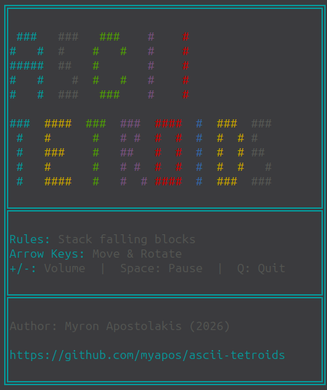

# ASCII Tetroids



A TypeScript terminal-based Tetris implementation with ASCII art rendering.

> **Disclaimer:** This is a fan-made project inspired by Tetris®. Tetris® is a registered trademark of The Tetris Company, LLC. This project is not affiliated with or endorsed by The Tetris Company, LLC.

## Quick Start

```bash
npm install && npm run dev
```

**Requirements:** Node.js v20.7.0+

## Scripts

```bash
npm run dev       # Development mode
npm run build     # Production bundle (~8-10KB)
npm test          # Run tests
npm run lint      # Lint with ESLint
npm run lint:fix  # Auto-fix lint errors
```

## How to Play

Use the keyboard controls to move and rotate pieces:

| Key               | Action                         |
| ----------------- | ------------------------------ |
| **← Left Arrow**  | Move piece left                |
| **→ Right Arrow** | Move piece right               |
| **↑ Up Arrow**    | Rotate piece                   |
| **↓ Down Arrow**  | Speed up gravity (drop faster) |
| **P or Space**    | Pause/Resume game              |
| **R**             | Play again (after game over)   |
| **+**             | Increase volume                |
| **-**             | Decrease volume                |
| **Q**             | Quit game gracefully           |

Complete rows to clear them and increase your score. The game ends when pieces stack to the top of the board.

## Architecture

Uses **Mediator Pattern** (decoupled mode management) and **Dependency Injection** (wired dependencies). Key design:

- **GameStateMediator**: Single source of truth for game state (splash → demo → playing → game-over)
- **Strategy Pattern**: Modes implement `IGameMode` and can be swapped
- **ModeLifecycle**: Auto-cleanup of listeners between mode switches
- **Alternate Screen Buffer**: Prevents frame flicker and scrolling

**Project Structure:**

```
src/game/             Game logic, rules, piece preview
src/modes/            DemoMode, ClassicMode (Strategy Pattern)
src/state/            GameStateMediator (Singleton), ModeLifecycle
src/rendering/        Terminal rendering with ANSI codes
src/input/            Event-based input handler
src/audio/            Cross-platform sounds (Linux/macOS/Windows)
src/shapes/           7 Tetroids piece definitions
src/utils/            Helper functions
```

**For detailed architecture diagrams, patterns, and design decisions, see [ARCHITECTURE.md](ARCHITECTURE.md)**

## Status

**Completed:**

- Full game logic and piece mechanics
- Demo mode with auto-play
- Score, levels, and difficulty selection
- Cross-platform audio system
- Debian/Windows/macOS packaging
- ESLint with pre-push hooks
- Full test suite

**Possible Future Work:**

- Score database/leaderboard
